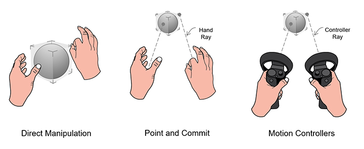

# Hands and motion controllers
## Scenarios
If you choose to adopt this interaction model after reading the [design guidelines](interaction-fundamentals.md), it means that you are developing an application requiring users to use two hands to interact with the holographic world. Your application is going to achieve the goal of removing the boundry between virtual and physical.

Some specific scenarios might be:
* Providing information workers 2D vitual screens and UIs to display and control contents
* Providing first line workers tutorials and guides in factory assembly lines
* Developing professional tools for assisting and educating medical professionals  
* Using 3D virtual objects to decorate the real world or to create a second world 
* Creating location based services and games using the real world as background

## Hands and motion controllers modalities
### [Direct manipulation with hands](direct-manipulation.md)
This is a modality leveraging the power of hands, with which users are capable of touching and manipulating the holograms directly. By leaveraging daily life experiences and providing proper visual affordances, users are able to use the same way of manipulating real world objects to interact with virtual ones.   

### [Point and commit with hands](point-and-commit.md)
This modality empowers users to interact with holograms in a distance. It enables users to make the best use of surroundings. Users can place holograms anywhere and can still access them from any distances. The mental models and gestures for controlling and manipulating 2D and 3D holograms are highly in sync with those of direct manipulation.

### [Motion controllers](motion-controllers.md)
Motion controllers are tools that extend the user's physical capabilities by providing precise interactions across a large range of distances while using one or both hands. These hardware accessories provide shortcuts to many commonly-used interactions and provide surefooted, tactile feedback for a variety of actions. Currently, motion controllers are only available for Windows Mixed Reality (WMR) scenarios. 

 

*Comparison of hands and motion controllers modalities*

## See also
* [Head-gaze and commit](gaze-and-commit.md)
* [Head-gaze and dwell](gaze-and-dwell.md)
* [Direct manipulation with hands](direct-manipulation.md)
* [Point and commit with hands](point-and-commit.md)
* [Hands-free](hands-free.md)
