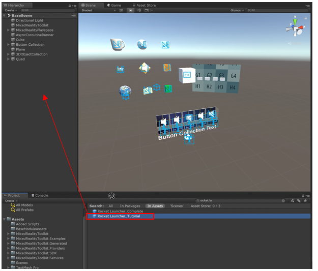
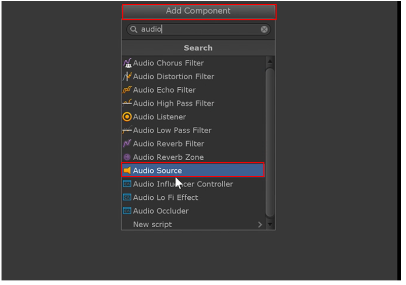
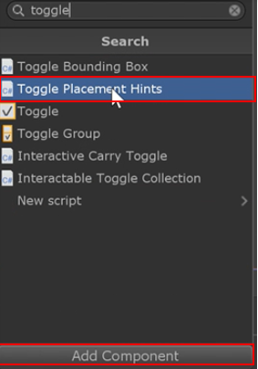
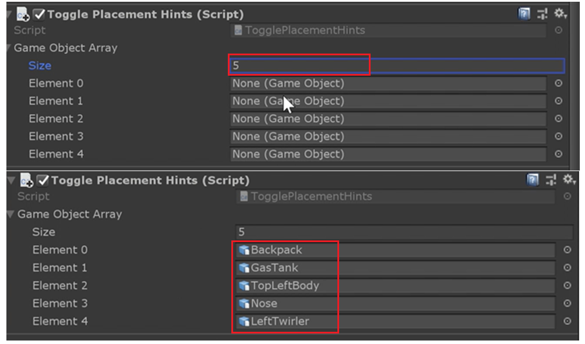
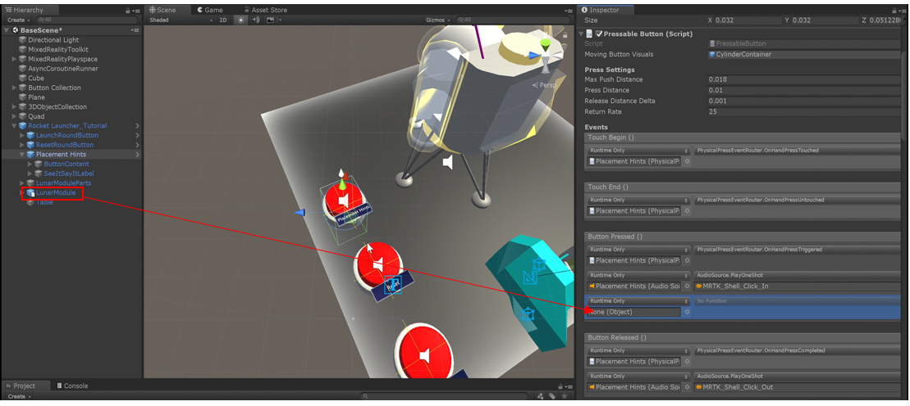
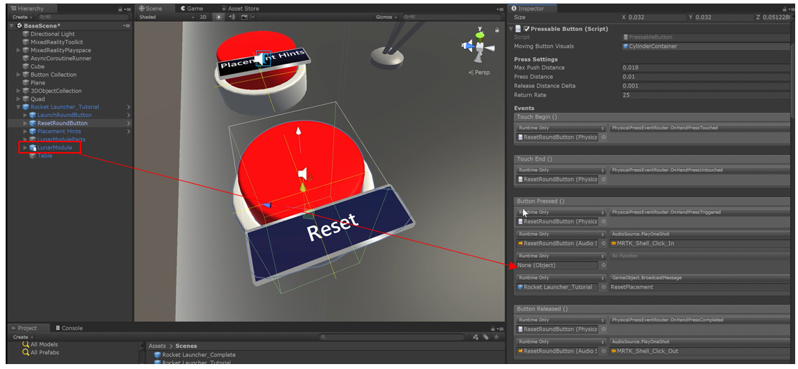
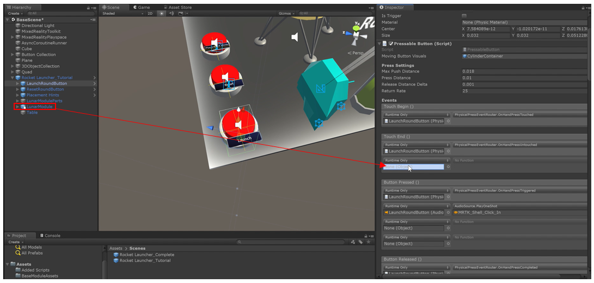
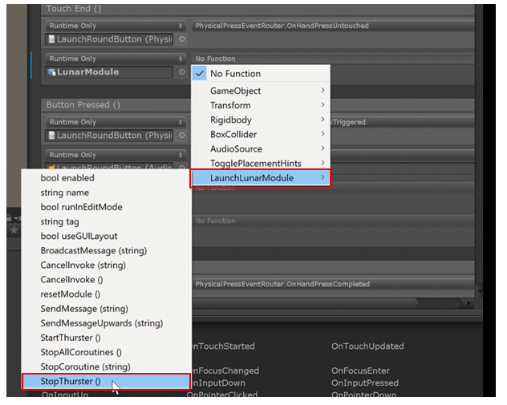
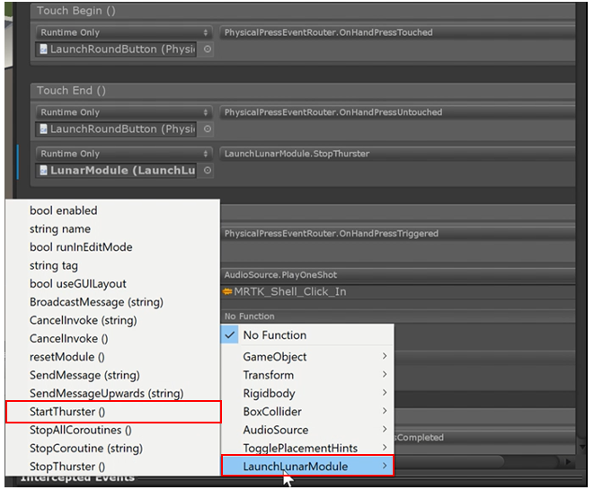

# 7. Creating a Lunar Module sample application

In this tutorial, we combine multiple concepts presented in the previous lessons to create a unique sample experience. We will create a lunar module assembly application whereby a user needs to use tracked hands to pick up lunar module parts, and attempt to assemble a lunar module. We use pressable buttons to toggle placement hints, to reset our experience, and to launch our lunar module into space! In future tutorials, we will continue to build upon this experience, which includes powerful multi-user use cases that leverage Azure Spatial Anchors for spatial alignment.

## Objectives

- Combine multiple concepts from previous lessons to create a unique experience
- Learn how to toggle objects
- Trigger complex events using pressable buttons
- Use rigidbody physics and forces
- Explore the use of tool tips

## Instructions

### Configuring the Lunar Module

In this section, we introduce the various components needed to create our sample experience.

1. Add the Lunar Module Assembly prefab to your base scene. To do this, from the Project tab, search for Rocket Launcher_Tutorial. 
Find the prefab in Assets->BaseModuleAssets->Prefabs. You'll also see two rocket launcher prefabs; one with the name "tutorial" and the other with the name "complete". Drag the Rocket Launcher_Tutorial prefab to your base scene, and position as you wish.
   Note: The Rocket Launcher_Complete prefab is the completed launcher, provided for reference. 

If you expand the Rocket Launcher_Tutorial game object in your hierarchy, and further expand the Lunar Module object, you find several child objects that have a material called, "x-ray." The "x-ray" material allows for a slightly translucent color that we will use as placement hints for the user. 

There are five parts to the lunar module that the user will interact with as shown in the image below:

1.	The Rover Enclosure
2.	The Fuel Tank
3.	The Energy Cell
4.	The Docking Portal 
5.	The External sensor

> Note: The Game object names that you see in your base scene hierarchy do not correspond to the names of the objects in the scene.

Step 2: Add an audio source to the lunar module. Make sure the lunar module is selected in your base scene hierarchy, and click Add Component. Search for Audio Source, and add it to the object. Leave it blank for now. We will use this to play the launching sound later.

   
Step 3: Add the script, Toggle Placement Hints. Click Add Component, and search for Toggle Placement Hints. This is a custom script that lets you turn on and off the translucent hints (objects with the x-ray material) mentioned earlier.  
  
Step 4: Since we have five objects, type in "5" for the game object array size. You'll then see five new elements appear.  

Drag each of the translucent objects into all the Name (Game Obect) boxes.
Drag the following objects from the lunar module in your base scene: 

•	Backpack

•	GasTank

•	Topleftbody

•	Nose

•	LeftTwirler

 

Now the Toggle Placement Hints script is configured. This allow us to turn hints on and off.

Step 5: Add the Launch Lunar Module script. Click the Add Component button, search for "launch lunar module", and select it. This script launches the lunar module. When we press a configured button, it adds an upward force to the lunar module's rigid body component, and causes the module to launch upwards. If you are indoors, the lunar module may crash against your ceiling mesh. But if you are outdoors, it will fly in to space indefinitely. 

Step 6: Adjust the thrust so that the lunar module will fly up gracefully. Try a value of 0.01. Leave the "Rb" field blank. Rb stands for rigid body, and this field will be automatically populated during runtime.

### Lunar Module Parts overview
The Lunar Module Parts parent object is the collection of the objects that the user interacts with. The Game object names, with scene labeled names in paretheses, are provided in the list below:

- Backpack (Fuel Tank)
- GasTank (Energy Cell)
- TopLeftBody (Rover Enclosure)
- Nose (Docking Portal)
- LeftTwirler (External Sensor)

Notice that each of these objects has a manipulation handler as discussed in Lesson 4. With the manipulation handler, users can grab and manipulate the object. Also note that the setting, Two Handed Manipulation Type is set to Move and Rotate. This only permits the user to move the object and not change its size, which is the desired functionality for an assembly application.
In addition, Far Manipulation is unchecked to allow only for direct interaction of module parts.

The Part Assembly Demo script (shown above) is the script that manages the objects that the user places on the lunar module by the user. 

The Object To Place field is the transform that is selected, as shown in the image above, the backpack/fuel tank associated with the object that it connects to. 

The Near Distance and Far Distance settings determine the proximity to which parts snap in place or can be released. For example, the backpack/fuel tank needs to be 0.1 units away from the lunar module before it will snap into place. The Far Distance setting sets the location where the object can be before it can detach from the lunar module. In this case, the user’s hand must grab the backpack/fuel tank and pull it 0.2 units away from the lunar module to remove it from snapping back into place.

The Tool Tip Object is the tool tip label in the scene. When the objects are snapped in place, the label is disabled. 

The Audio Source is automatically grabbed. 

### Placement Hints buttons
In [Lesson 2](mrlearning-base-ch2.md), you learned how to place and configure buttons to do things like change the color of an item or make it play a sound when it is pushed. We will continue to use those principles as we configure our buttons for toggling placement hints. 

The goal is to configure our button so that every time the user presses the Placement hint button, it toggles the visibility of the translucent placement hints. 

Step 1: Move the lunar module to the empty Runtime Only slot in the inspector panel while the Placement Hints object is selected in your base scene hierarchy. 
 
Step 2: Now click the No Function dropdown list. Go down to TogglePlacementHints, and under that menu select ToggleGameObjects (). ToggleGameObjects() toggles the placement hints on and off so that they are visible or invisible each time the button is pressed.  
 

### Configuring the Reset button

There will be situations where the user makes a mistake, or accidently throws the object away, or just wants to reset the experience. The Reset button adds the ability to restart the experience. 

Step 1: Select the Reset button. In the base scene, it’s named, ResetRoundButton. 

Step 2: Drag the lunar module from the base scene hierarchy into the empty slot under Button Pressed the inspector panel.
 

Step 3: Select the No Function dropdown menu, and hover over LaunchLunarModule,  select resetModule ().

> Note: Notice that by default, the GameObject.BroadcastMessage is configured to ResetPlacement. This broadcasts a message called, ResetPlacement for every child object of the RocketLauncher_Tutorial. Any object that has a method for ResetPlacement() responds to that message by resetting it's position. 

### Launching the lunar module
This section explaings how to configure the Launch button. This permits the user to press the button and launch the lunar module into space.

Step 1: Select the Launch button. In the base scene it’s called, LaunchRoundButton. Drag the lunar module to the empty slot under Touch End in the Inspector panel.
 
Step 2: Select the No Function dropdown menu, and hover over LaunchLunarModule, and select StopThruster (). This controls how much thrust the user wants to give to the lunar module. 
   
Step 3: Under ButtonPressed(), add the lunar module (click, hold, and drag) to the empty slot. 

Step 4: Click the No function dropdown menu, and hover over LaunchLunarModule, and select StartThruster (). 
   
Step 5: Add music to the lunar module so that music plays when the rocket takes off. To do this, drag the lunar module to the next empty slot under Button Pressed().

Step 6: Select the No Function dropdown menu, hover over AudioSource, and select PlayOneShot (AudioClip). Feel free to explore the variety of sounds included with the MRTK. For this example, we'll use "MRTK_Gem."
 

### Congratulations 
You have fully configured this application. Now, when you press play, you can fully assemble the lunar module, toggle hints, launch the lunar module, and reset it to start all over again.
