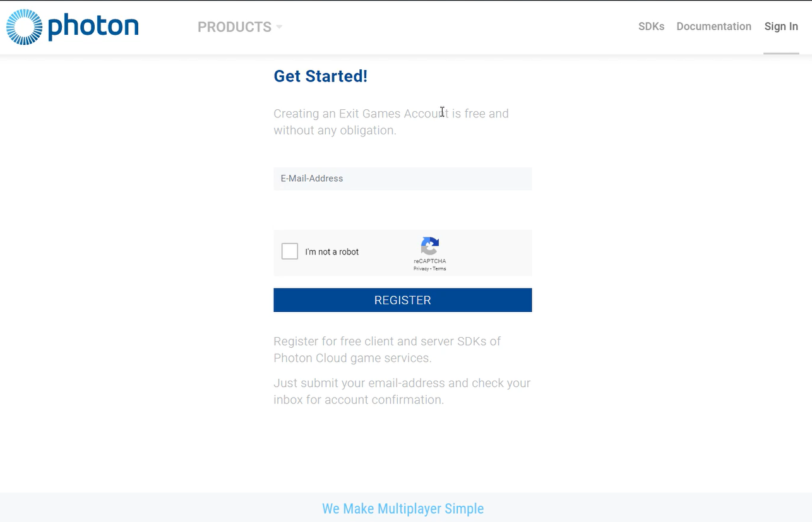
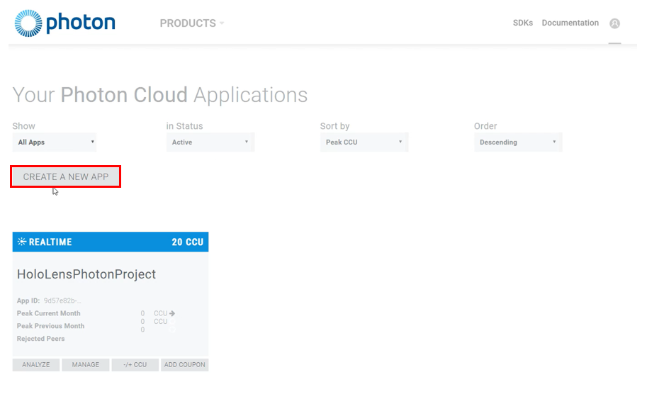
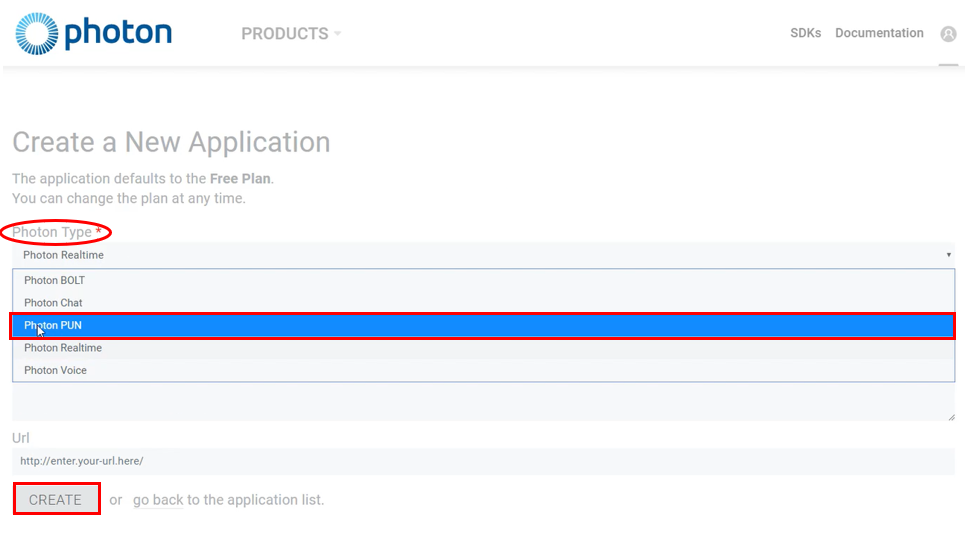
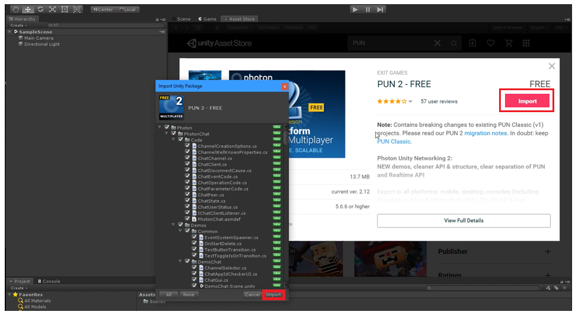

# Setting Up Photon

In this lesson, we will learn how to get ready for creating a shared experience by importing Photon Unity Networking (PUN) into your Unity project. Photon is one of several networking options available to Mixed Reality developers to create shared experiences. We we will learn how to create a Photon account, import Photon, and create an optional local server

Objectives:

* Learn how to create Photon account

* Learn how to find and import Photon Unity Networking

* Set up a local Photon server

  

### Setting Up Photon

1. Set up a [Photon](https://dashboard.photonengine.com/en-US/Account/SignUp) account. Navigate to the Photon Sign-up page by clicking on [this link](https://dashboard.photonengine.com/en-US/Account/SignUp). Follow the instructions on the sign-up page to create the account. 
   

2. Create an application ID by clicking the "create a new app" button.

3. Select "Photon PUN" from the dropdown menu under "photon type." Then give it a name, in this example, we named it "HoloLensPhotonProject." Once finished, click the "CREATE" button.

4. Once that is done, return to your applications page and you should see something similar to the picture below. Click on the app ID and copy it. Paste is somewhere you can easily access.  

5. Create a new unity project and name it "HLSharingProject." For instructions on how to create a new Unity project, please refer to [the Base Module's "Create Unity Project" section](https://docs.microsoft.com/en-us/windows/mixed-reality/mrlearning-base-ch1#create-new-unity-project). 

6. Once the project loads, click on the "assets store" tab, as shown in the image below. Then, in the search box highlighted in the image below, type in "PUN" and select the "Photon PUN-2 FREE" asset from the search results. 

7. Download and import this asset by pressing the "Download" and "Import" buttons.

8. Once Photon has completed the importing process, the Pun Wizard will appear. Take the application ID (which should be in your clipboard) from step 4 and paste it into the AppID box and press the "Setup Project" button. 

9. After successfully adding the AppID, navigate to "Photon"->"PhotonUnityNetworking" -> "Resources" ->  "PhotonServerSettings" in Assets. Select "Use Name Server" option and set the fixed region to "us" or your photon service region.

   

## Congratulations

You have successfully created a Photon account, set up a local Photon server, and imported PUN into Unity. Your next step is to set up the project and then allow connections with other users so that multiple users can see your work. 

[Next Lesson: Sharing(Photon) Lesson 2](mrlearning-sharing(photon)-ch2.md)

