# Speech SDK Learning Module - Intent and Natural Language Understanding

In this lesson, we will explore the Azure Speech Service's Intent feature. The Intent feature allows us to equip our application with AI-powered voice commands, where users can say non-specific voice commands, and still have their intent understood by the system. During this lesson, we will set up our Azure LUIS Portal, setup our Intent/Entities/Utterances, publish our Intent Resource, connect our Unity app to our Intent Resource, and make our first Intent API call.

## Objectives

- Learn how to set up intent and natural language understanding in our application
- Learn how to set up Azure's LUIS Portal
- Learn how to set up intent, entities, and utterances on Azure

## Instructions
1. Allow your machine to enable Dictation, to do this, go to Windows Settings, select "privacy," then "speech," and finally "inking & typing" and turn on speech services and typing suggestions.

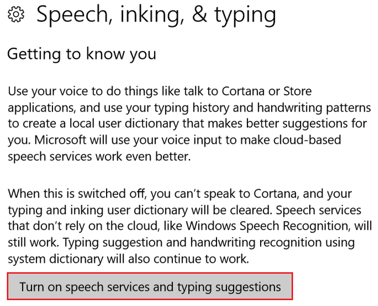

2. Log in to the [Azure Portal](https://portal.azure.com/). Once you are logged in, click on Create a resource, and search for "Language Understanding," and click enter.

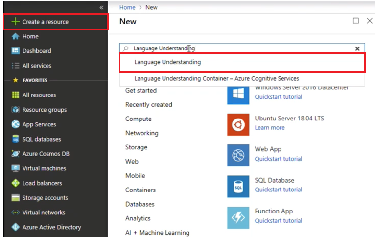

3. Select the Create button, to create an instance of this service. Name your project “Speech_SDK_Learning_Module” and select “Pay As You Go.”

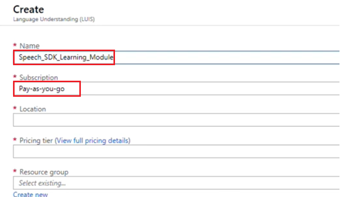

4. Select your Region.  For the purpose of this tutorial, select "(US) West US." Then choose "F0" for the pricing tier. Now click "create" (located in the bottom left corner) to create the resource.

>  Note: once you have clicked on "create," you will have to wait for the service to be created, this might take a minute.

5. A notification will appear in the portal once the Resource is created. Click on this notification and select "Go to resource."

6. From the "Quick Start" page of your "LUIS API" service, navigate to the first step, grab your "keys," and click "keys" (you can also achieve this by clicking the blue hyperlink "keys," shown in the image below). This will reveal your service, "Keys." Save a copy of one of the keys so you can use it later in the app.

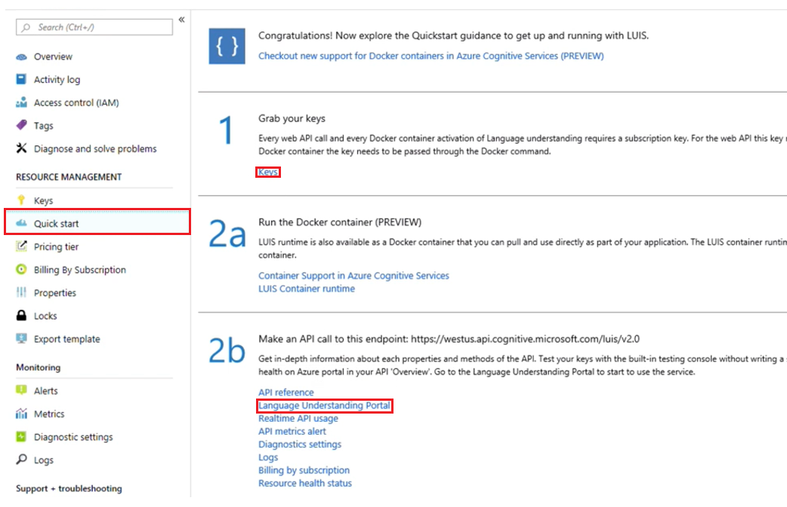

7. Back in the "Quick Start" page under Section 2b, click on "Language Understanding Portal" (shown in the image above) to be redirected to the webpage which you will use to create your new service, within the LUIS application.

> Note: Upon reaching the "Language Understanding Portal," you may need to login, if you are not already, with the same credentials as your Azure portal. If this is your first time using LUIS, you will need to scroll down to the bottom of the welcome page, to find and click on the "Create LUIS" app button.

8. Once logged in, click My Apps (if you are not in that section currently). You can then click on Create new app. Name the new app “Speech SDK Learning Module.” Add “Speech SDK Learning Module" to the description field, as well. Then click "done."

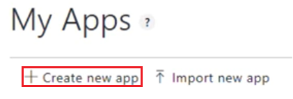

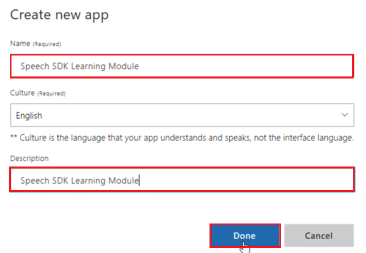

> note: If your app is supposed to understand a language different from English, you should change the "Culture" to the appropriate language.

9. Click “Build” located in the top right.

10. Under App Assets on the left, select “Intents” then click “Create New Intent” and name it “PressButton.” 

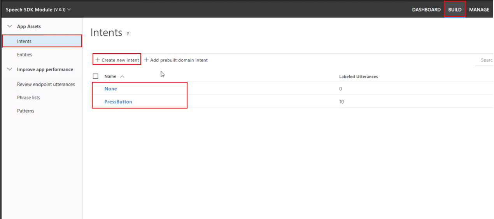

> Note: It is important to use the names of Intents and Entities used in this tutorial because the Lunarcom app will be referencing them by name. 
>
> Note: you should now have 2 Intents - “PressButton” and “None."

11. Under App Assets on the left, select “Entities” and click “Create New Entity” and name it “Action” and keep the Entity Type as “Simple.”

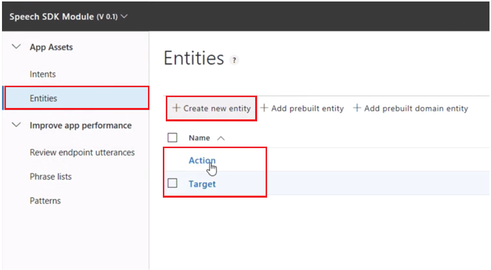

12. Click “Create New Entity” again and name it “Target” and keep the Entity Type as “Simple” as well.

13. Under App Assets on the left, select "Intents" then click on your "PressButton" Intent that you created in step 10.

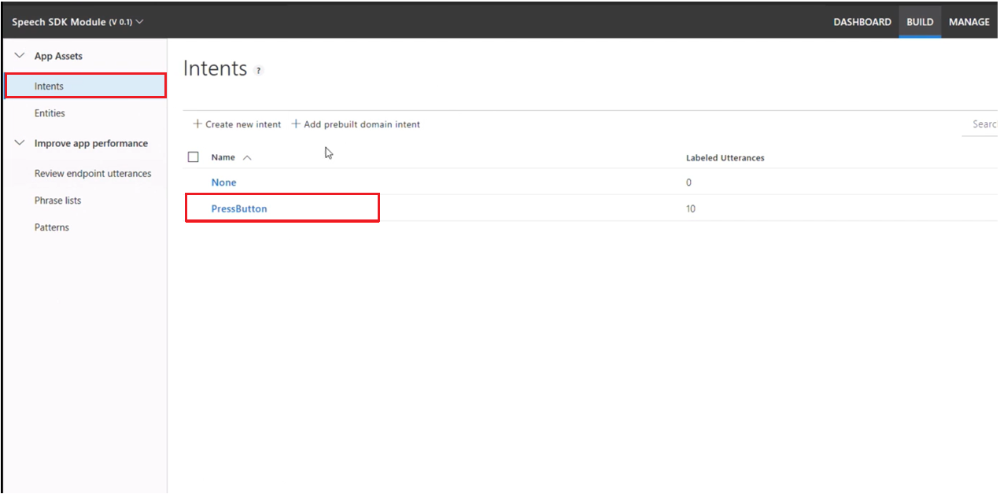

14. Click on the "View options" dropdown on the right and select "show entity values." 

Click on the “Enter an example…” textbox. Then, enter the following utterances: 

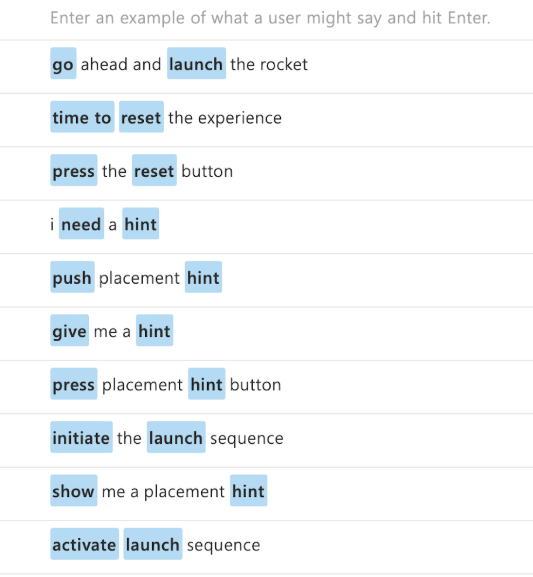

15. Click on the "View options" dropdown on the right and select "Show entity names."

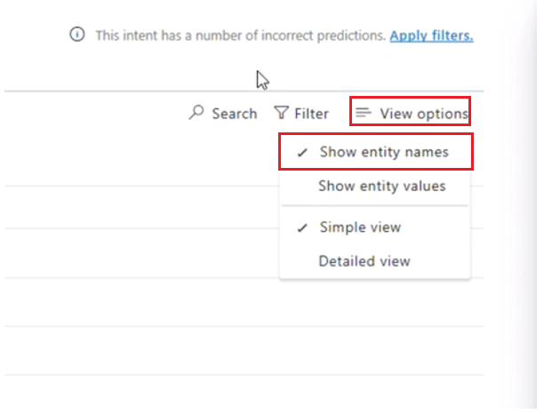

16. Ensure that each of the 10 Utterances have the following Entity labels in the following places by 1.) clicking on words that are mislabeled and, in the popup, selecting "remove label" and 2.) clicking on words that should be labeled and, in the popup, selecting the appropriate label.

17. Now, to publish the model, click "Train" in the top right. Then, once it has finished processing, click "Test" in the top right.

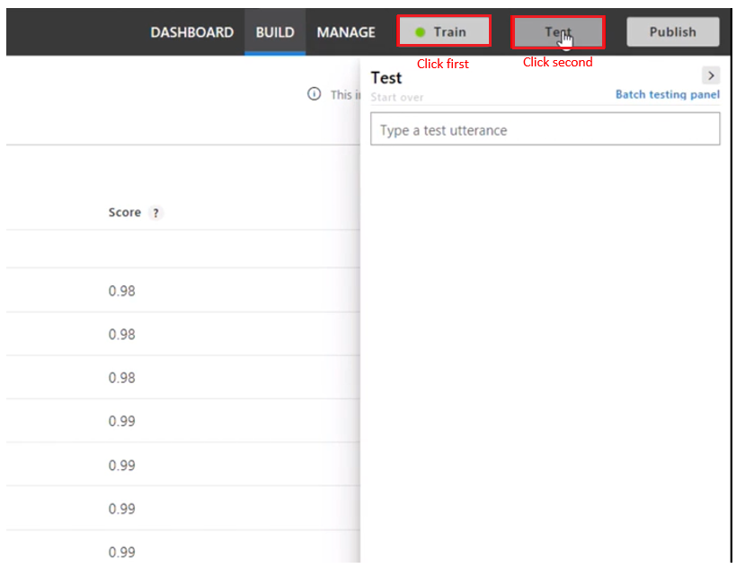

18. Enter in “select the launch button” in  the textbox.

> note: we did not add “select” as an action in any of our Utterances - but if you click on “Inspect,” the model recognized “select” as an action entity.
>
> 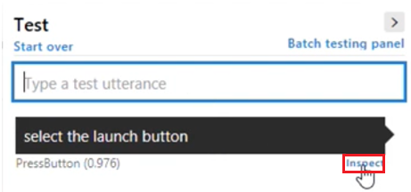

19. Now, click "publish" in the top right. Ensure the dropdown says “Production” and click "publish" on the popup as well. 

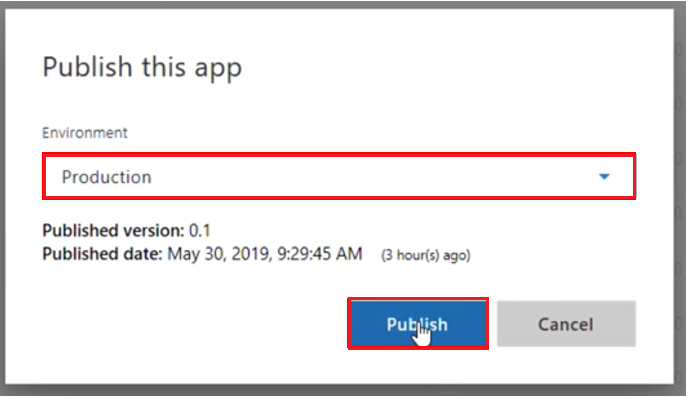

20. Once published, a green bar should appear at the top of the page.  Click on the green bar to be taken to the "Manage" page. 

21. Click on "Keys and Endpoints" under “Application Settings” to the left. Then, set the drop down "Publish To" as "Production." Set the time-zone to match yours, and check the box to include all predicted intent scores. Lastly, Click on "Assign resource."

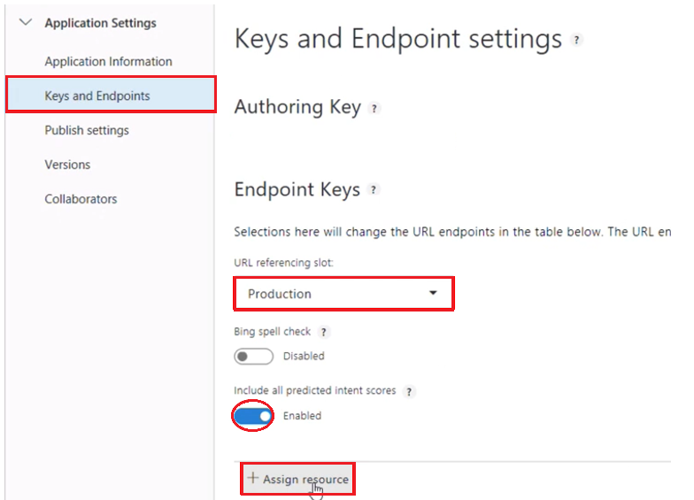

22. Select tenant from the first dropdown, and select “Pay-as-you-go” in the Subscription Name dropdown. Under LUIS resource name, choose the resource that we created above in steps 1-5. Then, click on "Assign resource." 

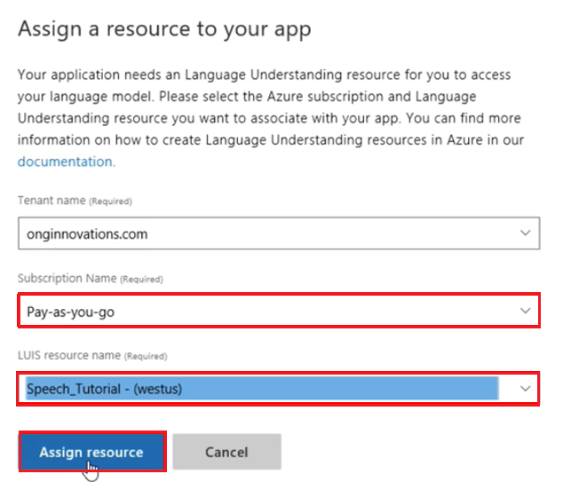

> Note: Ensure to copy and save the Endpoint URL associated with the resource we just assigned so that it is easily accessible for the next section.
>
> Note: For the Tenant name, put your corporation or profile that you created for this application.

23. Now, open the new app in Unity and select the Lunarcom_Base object in the hierarchy. Click “Add Component” in the inspector panel and search for and select “LunarcomIntentRecognizer.”

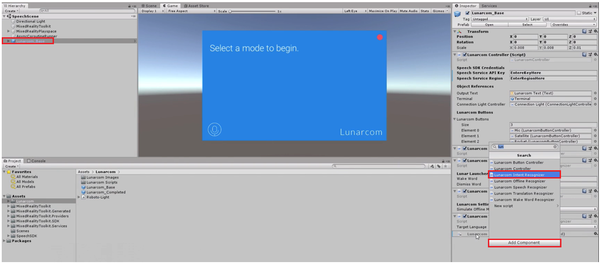

24. In the Luis Endpoint field of the "LunarcomIntentRecognizer" in the inspector panel, enter the Endpoint URL that you saved in step 22. 

>  Note: In the "LunarcomOfflineRecognizer" component in the inspector panel, make sure that “disable” is selected for "SimulateOfflineMode" otherwise, testing the program will not work. 

25. Press the Play button in the Unity Editor and click the rocket button to start intent recognition. Utter the phrase “select the launch rocket button.”

>  Note: The app recognized the desired function and activated the rocket button.
>
> 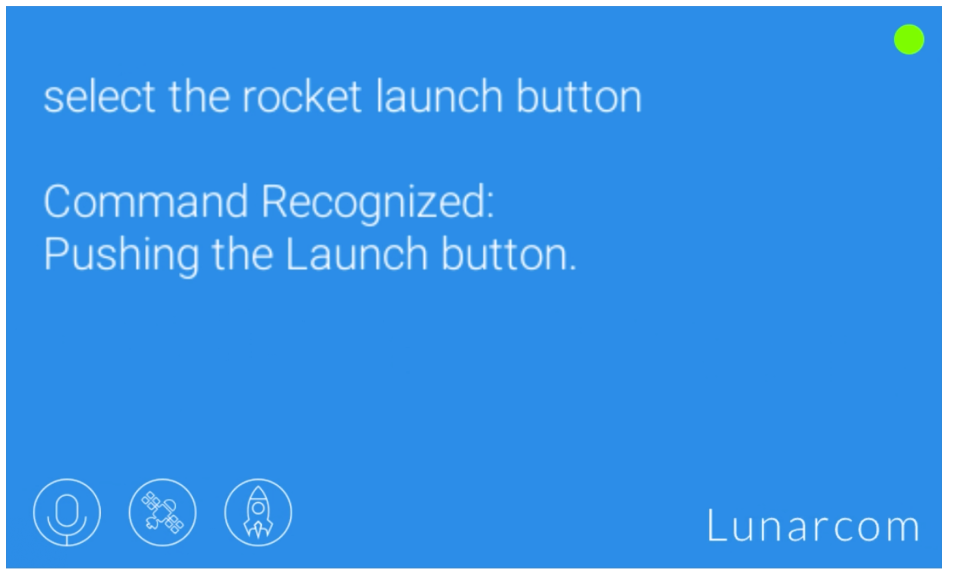

## Congratulations

In this lesson, we learned how to add AI-powered speech commands! Now your program can recognize users' intent even if they do not utter precise voice commands.

